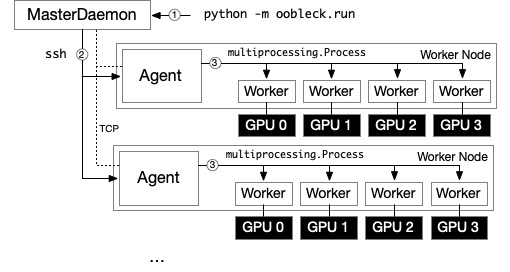
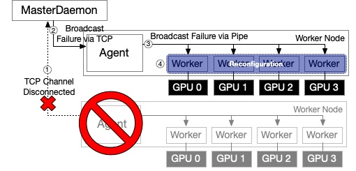

<h1 align="center">Oobleck<br>
Resilient Distributed Training Framework</h1>

Oobleck is a large-model training framework with fast fault recovery support utilizing the concept of *pipeline templates*.

## Getting Started

### Install

Oobleck relies on `conda` for both installation and **running**. Pleasae install `conda` from Anaconda website. Then, install the Oobleck environment and package.

```bash
conda env create -f environment.yml
conda activate oobleck
(oobleck) pip install .
...
Successfully installed oobleck-0.1.0
```

### Run

1. Run a master daemon. If you run multi-node training, feeding a public ip to `--ip` is required. If `--port` is not specified, randomly available port is used.
    ```bash
    python -m oobleck.elastic.master (--ip <ip>) (--port <port>)
    ```

2. Submit a training job to the master. `--node_ips` is a list separated by whitespaces.

    ```bash
    python -m oobleck.run --config_path <config_yaml> --node_ips [node_ips] (--node_port <node_port>) --master_ip <master_ip> --master_port <master_port>
    ```

    `--node_port` specifies the ssh port of worker nodes. The master daemon will launch agent processes on nodes through ssh. All of them must use the same port number and specified here, and the node where the master daemon is running should be able to passwordless ssh to nodes.

    - An example of `node_ips` in command line:
        ```bash
        --config_path examples/gpt2.yml --node_ips 192.168.0.1 192.168.0.2 192.168.0.3 192.168.0.4 --master_ip ...
        ```

    - Format of yaml config file
    
        A file specified in `--config_path` is parsed to create `DistributedJobConfiguration` dataclass defined in `elastic/training_util.py`.
        Each key in yaml file corresponds to each attributes in `DistributedJobConfiguration` dataclass.

        Example
        ```yaml
        master_ip: 192.168.0.1
        master_port: 12345
        node_ips:
        - 192.168.0.2
        - 192.168.0.3
        - 192.168.0.4
        - 192.168.0.5
        job_args:
            model_name: gpt2
            dataset_path: wikitext
            dataset_name: wikitext-2-raw-v1
            ...
        ```
        All fields are required, however, you can specify them either in your yaml file or in command line.


## Architecture

Oobleck consists of three types of processes: master daemon, agent, and worker.



The master daemon automatically launches agents to all given nodes via ssh.
When agents are launched, they establish a TCP channel with the master daemon, receive a job configuration, and launches worker processes via `multiprocessing.Process` in each node. The TCP channels are only used for fault tolerance, not for training.

Worker processes use `torch.distributed` for distributed training.



When node(s) fail, the master daemon detects it via a TCP channel disconnection event. It then broadcasts a node failure event to all the other nodes.
'the agents rebroadcast the event to workers via Linux pipes. After that, workers begin reconfiguration, i.e., reinstatiating pipelines, copying missing layers, reconstructing torch distributed groups, etc.
## Citation

```bibtex
@inproceedings{oobleck-sosp23,
    title     = {Oobleck: Resilient Distributed Training of Large Models Using Pipeline Templates},
    author    = {Jang, Insu and Yang, Zhenning and Zhang, Zhen and Jin, Xin and Chowdhury, Mosharaf},
    booktitle = {ACM SIGOPS 29th Symposium of Operating Systems and Principles (SOSP '23)},
    year      = {2023},
}
```

## Implementation Limitations
Oobleck is an ongoing research prototype and currently lacks some features, including:

- Different precisions: AMP (Automatic Mixed Precision)/BF16/FP16 training is not supported yet.
- Sharing model states: Sharing model states across nodes is not supported yet (e.g. GPT embedding layer is shared between the first pipeline stage and the last pipeline stage). Due to this, training may not be correct.
- Richer documentation
- Modualization: We are working on improving Oobleck compatibility to HuggingFace `
Transformer` and `Accelerate`.