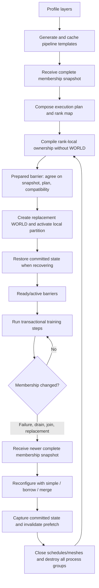

# Oobleck

Oobleck is a heterogeneous elastic pipeline-training runtime built around
Cornstarch's plan/context model. It chooses rank-local ownership before WORLD,
uses checksummed membership generations, fully replaces the process-group
universe on every change, and treats each logical global batch as a replayable
transaction.

```python
plan = OobleckParallelizationPlan(
    OobleckConfig(global_batch_size=128, microbatch_size=2, max_nodes=16)
)
plan.parallelize(model, ParallelConfig(tensor_parallel_size=8))
context = plan.materialize("cuda", dtype=torch.bfloat16)

sampler = context.create_batch_sampler(dataset, shuffle=True)
dataloader = DataLoader(dataset, batch_sampler=sampler, persistent_workers=False)
loader = context.prepare_dataloader(dataloader)
context.configure_optimization(
    optimizer_factory=lambda parameters: torch.optim.AdamW(parameters, lr=1e-4)
)
for batch in loader:
    context.step(batch, execution_plan, output, criterion)
```

The first release supports stable map-style datasets and fixed per-node tensor
parallel width. Oobleck selects heterogeneous pipeline and effective data
parallel layouts. Context/expert parallelism, streaming-dataset replay, elastic
TP width, multimodal models, and master high availability are out of scope.

See [the examples](examples/README.md), the architecture decisions in
[`docs/adr/`](docs/adr/), and [`tasks/plan.md`](tasks/plan.md) for the full
design and acceptance contract.

## Runtime lifecycle

Oobleck separates the CPU control plane from the distributed training data
plane. The control plane decides which complete membership generation may run;
the data plane compiles ownership, creates that generation's process groups,
executes transactional steps, and moves committed state when membership
changes.


```mermaid
flowchart TD
    P["Profile layers"] --> T["Generate and cache pipeline templates"]
    T --> M["Receive complete membership snapshot"]
    M --> C["Compose execution plan and rank map"]
    C --> L["Compile rank-local ownership without WORLD"]
    L --> PB["Prepared barrier: agree on snapshot, plan, compatibility"]
    PB --> W["Create replacement WORLD and activate local partition"]
    W --> R["Restore committed state when recovering"]
    R --> AB["Ready/active barriers"]
    AB --> S["Run transactional training steps"]
    S --> F{"Membership changed?"}
    F -- "No" --> S
    F -- "Failure, drain, join, replacement" --> NM["Receive newer complete membership snapshot"]
    NM --> RP["Reconfigure with simple / borrow / merge"]
    RP --> X["Capture committed state and invalidate prefetch"]
    X --> D["Close schedules/meshes and destroy all process groups"]
    D --> L
```

### 1. Profile the model and generate pipeline templates

[`planning/profiler.py`](oobleck/planning/profiler.py) measures each repeated
layer's execution time, activation memory, and persistent state. The resulting
versioned `ModelProfile` can be saved and loaded independently of a running
distributed job. [`planning/generator.py`](oobleck/planning/generator.py) turns
those layer measurements into candidate `PipelineTemplate` objects through the
Rust planner extension, with a deterministic Python fallback.

[`planning/cache.py`](oobleck/planning/cache.py) records templates with their
model, dtype, TP, hardware, and Cornstarch compatibility fingerprint.
[`planning/composer.py`](oobleck/planning/composer.py) chooses a heterogeneous
combination of templates for the available nodes and assigns the logical global
microbatches among the resulting pipeline instances.

### 2. Register nodes and compile ownership before WORLD

The master and node agents communicate only through the CPU control plane in
[`elastic/`](oobleck/elastic/). An agent registers its stable node ID,
incarnation, reachable addresses, and GPU IDs, then maintains a heartbeat lease.
The master publishes every join, replacement, drain, disconnect, or lease
expiry as a complete, monotonically newer `MembershipSnapshot`.

Each GPU worker receives the snapshot from its local agent over the Unix-domain
relay in [`elastic/local_ipc.py`](oobleck/elastic/local_ipc.py). It gives the
membership to `OobleckParallelizationPlan`, which:

1. uses [`planning/composer.py`](oobleck/planning/composer.py) for the initial
   layout or [`planning/reconfiguration.py`](oobleck/planning/reconfiguration.py)
   for a simple, borrow, or merge recovery;
2. creates a stable node/rank map and an immutable, checksummed
   `OobleckExecutionPlan`;
3. calls [`cornstarch.py`](oobleck/cornstarch.py) to compile the rank-local
   stage and logical state manifest without initializing `torch.distributed` or
   allocating real parameter storage.

Workers report the snapshot hash, plan checksum, and runtime compatibility
digest through the **prepared** barrier. The master publishes rendezvous data
only after every agent agrees on all three values.

### 3. Initialize distributed execution

After the prepared barrier,
[`distributed/lifecycle.py`](oobleck/distributed/lifecycle.py) creates exactly
one replacement WORLD from the generation's deterministic rank map and
rendezvous address. [`cornstarch.py`](oobleck/cornstarch.py) then activates the
compiled local partition, materializes local state, and constructs the
per-pipeline meshes from [`meshes.py`](oobleck/meshes.py).

[`topology.py`](oobleck/topology.py) builds additional gradient synchronization
groups by stable logical layer identity and TP lane, allowing parameters shared
across heterogeneous pipeline replicas to receive correctly weighted global
gradients. Each worker reports **ready** only after activation and any recovery
finish. The master sends **generation active** only when every agent is ready;
managed training steps remain blocked until that final barrier.

### 4. Execute a transactional training step

[`data_base.py`](oobleck/data_base.py) assigns explicit sample indices and
global microbatch IDs to every logical batch. DataLoader prefetch may run ahead,
but `OobleckBatchSampler.committed_cursor` advances only when the step commits.
Logical RNG seeds depend on the batch and microbatch identity rather than the
physical rank, so replay uses the same data and randomness after reconfiguration.

`OobleckParallelContext.step()` in
[`runtime_base.py`](oobleck/runtime_base.py) executes only the microbatches
assigned to the local pipeline, synchronizes Cornstarch and heterogeneous
replica gradients, and then atomically advances:

- optimizer and optional gradient scaler;
- scheduler;
- committed training step;
- DataLoader sampler cursor.

If a membership change becomes pending before that atomic commit, Oobleck
discards the attempt's gradients and does not advance any of those objects.

### 5. Detect failures and propagate membership events

[`elastic/service.py`](oobleck/elastic/service.py) and
[`elastic/service_public_base.py`](oobleck/elastic/service_public_base.py) run
the reconnecting agent streams. A TCP close is an immediate failure signal;
otherwise [`elastic/membership.py`](oobleck/elastic/membership.py) expires the
agent's heartbeat lease. The same state machine handles explicit drains, new
nodes, and a new incarnation replacing an old node identity.

The event path is:

```text
master membership state machine
  -> complete membership snapshot over TCP
  -> node agent
  -> local Unix-domain relay
  -> every local GPU worker
  -> OobleckParallelContext.apply_membership()
```

The master coalesces the current live set into a generation rather than sending
rank-local patches. If another event arrives while a generation is preparing or
recovering, the newer complete snapshot supersedes the stale generation; that
generation is torn down and never becomes active.

### 6. Reconfigure workers and copy committed state

The recovery methods layered onto `OobleckParallelContext` in
[`runtime.py`](oobleck/runtime.py) perform two coordinated phases.

When `apply_membership()` receives the newer snapshot, it first updates the
stable membership/rank map and builds a pending execution plan. For a recovery,
[`planning/reconfiguration.py`](oobleck/planning/reconfiguration.py) chooses
the simple, borrow, or merge layout before the active world is retired.

**Prepare the new generation:**

1. [`recovery_base.py`](oobleck/recovery_base.py) captures the last committed
   parameter, persistent-buffer, optimizer, scheduler, scaler, and step state.
2. Prepared DataLoaders invalidate prefetched but uncommitted batches.
3. The active Cornstarch partition, schedules, meshes, and heterogeneous
   gradient groups close.
4. [`distributed/lifecycle.py`](oobleck/distributed/lifecycle.py) concurrently
   shuts down every known backend, destroys WORLD, clears the audited PyTorch
   c10d registries, and verifies that WORLD is no longer initialized.
5. Cornstarch compiles the pending plan's new local ownership while no
   distributed world exists.

**Activate and recover after rendezvous:**

1. Oobleck creates the replacement WORLD and activates the compiled partition.
2. [`state_base.py`](oobleck/state_base.py) matches old and new state through
   stable logical keys, TP lanes, placements, and committed versions.
3. [`state.py`](oobleck/state.py) plans retained shards and missing state
   transfers. It chunks complete parameter/optimizer bundles and balances source,
   destination, round, and link load across surviving replicas.
4. [`state_transfer.py`](oobleck/state_transfer.py) executes the immutable,
   checksummed schedule with variable-split `all_to_all_single` rounds.
5. [`recovery.py`](oobleck/recovery.py) restores parameters, buffers, optimizer
   slots and groups, scheduler, scaler, and committed-step metadata, then rebuilds
   heterogeneous gradient synchronization.

After every worker reports ready, the master activates the generation. The
interrupted logical batch is fetched again from the unchanged committed cursor
and replayed; it can commit exactly once under the new generation.

## Package directory guide

The import without a suffix is the authoritative public/current implementation.
Several areas deliberately keep a lower-level `*_base.py` module containing
core value types or mechanics. Some public modules import and extend that base
directly; in other pairs the base is a retained lower-level reference and the
public module contains the current implementation. When tracing a code path,
start at the public module and follow its imports. `state.py` has one additional
active intermediate layer, `state_public_base.py`.

### Top-level `oobleck/` modules

| File | Responsibility |
| --- | --- |
| [`__init__.py`](oobleck/__init__.py) | Defines the supported top-level public API: plans, contexts, batches, state manifests, configuration, and compatibility helpers. |
| [`acceptance.py`](oobleck/acceptance.py) | Emits JSONL runtime/recovery metrics and verifies replay, strategy coverage, CUDA-memory growth, process-group growth, and clean shutdown for optional chaos/churn runs. |
| [`cli.py`](oobleck/cli.py) | Tyro command dispatcher for the master, agent, training launch, profiling, membership inspection, drain, and guarded chaos helper. |
| [`compatibility.py`](oobleck/compatibility.py) | Builds model, dataset/preprocessing, package revision, CUDA/NCCL, and hardware fingerprints used for cross-worker generation consensus. |
| [`config.py`](oobleck/config.py) | Serializable command configurations for master/agent services, launch, profiling, drain, inspection, and chaos injection. The training runtime's `OobleckConfig` lives in `types.py`. |
| [`types.py`](oobleck/types.py) | Immutable public value types: templates, stage specs, pipeline instances, execution plans, runtime compatibility, checksums, rank maps, and runtime configuration. |
| [`runtime_base.py`](oobleck/runtime_base.py) | Core `OobleckParallelizationPlan`, prepared/context objects, initial plan compilation/materialization, DataLoader attachment, and logical step transaction. |
| [`runtime.py`](oobleck/runtime.py) | Public runtime layer that extends the base context with membership application, two-phase generation replacement, supersession, state recovery, generation barriers, transition metrics, and complete topology-aware close. |
| [`cornstarch_base.py`](oobleck/cornstarch_base.py) | Retained minimal compile/activate adapter and fallback local-manifest reference for the pinned Cornstarch lifecycle. The active runtime imports `cornstarch.py`. |
| [`cornstarch.py`](oobleck/cornstarch.py) | Current Cornstarch boundary used by the runtime; preserves the execution plan through compilation, imports Cornstarch manifests, creates heterogeneous meshes on activation, and retires external contexts idempotently. |
| [`data_base.py`](oobleck/data_base.py) | Deterministic logical batch descriptors, committed-cursor sampler, microbatch slicing, prefetch invalidation, replay, and the prepared DataLoader adapter. |
| [`data.py`](oobleck/data.py) | Public DataLoader facade; re-exports the base types and adds strict validation that sampler and DataLoader use the exact same dataset object. |
| [`meshes.py`](oobleck/meshes.py) | Creates deterministic per-pipeline Cornstarch `DeviceMesh` objects from an execution plan's heterogeneous stage/rank layout. |
| [`topology.py`](oobleck/topology.py) | Derives cross-pipeline gradient groups from logical parameter identity and TP lane, creates the process groups, applies sample-weighted synchronization, and closes the groups. |
| [`optimization_base.py`](oobleck/optimization_base.py) | Retained lower-level versioned optimizer-schema and logical-key serialization/restore reference. The active recovery path imports `optimization.py`. |
| [`optimization.py`](oobleck/optimization.py) | Current optimizer-state implementation, including partition-manifest keys, local DTensor shard extraction, optimizer-group reconstruction, and device/dtype-aware slot restore. |
| [`state_base.py`](oobleck/state_base.py) | Defines logical state entries, manifests, transfers, immutable schedule checksums, candidate/version validation, chunking, round packing, locality classification, and balanced source selection. |
| [`state_public_base.py`](oobleck/state_public_base.py) | Intermediate public planner that gives each homogeneous source/destination link an independent load class, then normalizes reported link metrics. |
| [`state.py`](oobleck/state.py) | Final public state API; supplies topology-free bandwidth defaults so destination ingress does not hide the source-load balancing tie-break. This is the module runtime/recovery code imports. |
| [`state_transfer.py`](oobleck/state_transfer.py) | Packs tensors into the planned byte ranges, executes collective all-to-all rounds, validates dtype/checksum/reconstruction, and returns transfer timing/load metrics. |
| [`recovery_base.py`](oobleck/recovery_base.py) | Captures committed model/buffer/optimizer/scheduler/scaler state, builds combined manifests and logical tensor bindings, copies retained state, and defines recovery snapshots/reports. |
| [`recovery.py`](oobleck/recovery.py) | Public recovery coordinator; gathers old and new manifests across ranks, plans every destination together, executes transfer schedules, restores optimizer/training metadata, and reports planning/transfer balance. |

### `oobleck/planning/`

| File | Responsibility |
| --- | --- |
| [`__init__.py`](oobleck/planning/__init__.py) | Re-exports the supported profiling, template, composition, and reconfiguration API. |
| [`profiler.py`](oobleck/planning/profiler.py) | Measures model layers with a model-agnostic workload and records versioned execution/memory profiles. |
| [`generator.py`](oobleck/planning/generator.py) | Narrow binding around the Rust template generator with deterministic Python partitioning fallback. |
| [`planner.pyi`](oobleck/planning/planner.pyi) | Type stub for the compiled Rust `create_pipeline_templates` extension. |
| [`cache.py`](oobleck/planning/cache.py) | Saves and loads versioned templates while validating schema and compatibility fingerprints. |
| [`composer.py`](oobleck/planning/composer.py) | Selects a deterministic heterogeneous template composition, maps it to nodes, allocates global microbatches, and computes gradient sample weights. |
| [`reconfiguration.py`](oobleck/planning/reconfiguration.py) | Pure membership replanner implementing simple re-instantiation, node borrowing, pipeline merge, joins/replacements, and deterministic state-retention/throughput objectives. |

### `oobleck/distributed/`

| File | Responsibility |
| --- | --- |
| [`__init__.py`](oobleck/distributed/__init__.py) | Exports replacement-WORLD initialization, full teardown, and the guarded layout error. |
| [`lifecycle.py`](oobleck/distributed/lifecycle.py) | Active process-group lifecycle: validates deterministic rendezvous inputs, initializes replacement WORLD, concurrently shuts down every known group, destroys WORLD, clears version-audited c10d registries, and verifies retirement. |
| [`lifecycle_base.py`](oobleck/distributed/lifecycle_base.py) | Retained lower-level teardown reference for registry clearing. The active `lifecycle.py` adds replacement initialization and explicit PyTorch-version/layout guards. |

### `oobleck/elastic/`

| File | Responsibility |
| --- | --- |
| [`__init__.py`](oobleck/elastic/__init__.py) | Re-exports the public membership, transport, local-worker, service, and hostfile API. |
| [`membership.py`](oobleck/elastic/membership.py) | Transport-independent membership state machine: stable identities/incarnations, registration, heartbeats, acknowledgements, leases, disconnects, drains, event coalescing, stale-message rejection, and snapshot hashing. |
| [`transport.py`](oobleck/elastic/transport.py) | Strict JSON `MessageEnvelope` schema and bounded length-prefixed asyncio transport, including partial-read handling, serialized writes, and backpressure. |
| [`service_base.py`](oobleck/elastic/service_base.py) | Master generation protocol and base agent stream: registration, heartbeat/lease processing, membership proposals, prepared-plan consensus, rendezvous publication, ready consensus, activation, drain, and inspection. |
| [`service_public_base.py`](oobleck/elastic/service_public_base.py) | Current reconnecting `NodeAgentClient`, local-worker phase aggregation, master sequence validation, TCP-close handling, and public inspect/status/drain helpers. |
| [`service.py`](oobleck/elastic/service.py) | Public service facade; combines the current client/helpers with the master and bounds broadcasts so a failed writer becomes a membership event instead of stalling recovery. |
| [`local_ipc.py`](oobleck/elastic/local_ipc.py) | Unix-domain relay between one CPU agent and its GPU workers. Aggregates every local worker's prepared/ready metadata and enforces membership, rendezvous, and active phase ordering. |
| [`workers.py`](oobleck/elastic/workers.py) | Agent-owned process supervisor that launches one training worker per configured GPU, assigns stable environment identity/rank data, and retires workers on completion or failure. |
| [`hostfile.py`](oobleck/elastic/hostfile.py) | Parses an optional bootstrap-only host inventory and constructs explicit SSH agent commands; later joins do not depend on the hostfile. |

## Suggested reading paths

- **Initial configuration:** `planning/profiler.py` → `planning/generator.py` →
  `planning/composer.py` → `runtime_base.py` → `cornstarch.py` →
  `distributed/lifecycle.py`.
- **Training and commit semantics:** `data_base.py` → `runtime_base.py` →
  `topology.py`.
- **Failure/event propagation:** `elastic/membership.py` →
  `elastic/service.py` → `elastic/local_ipc.py` → `runtime.py`.
- **Worker reconfiguration and data copy:** `runtime.py` →
  `distributed/lifecycle.py` → `planning/reconfiguration.py` → `recovery.py`
  → `state.py` → `state_transfer.py`.

## Development

```bash
pytest -q
cargo test
python examples/run_local.py
python benchmarks/recovery_schedule.py
python benchmarks/transaction_overhead.py
```

The Rust planner binding requires PyO3 and `pyo3-build-config` 0.24.1 or newer;
its exact transitive versions are recorded in `Cargo.lock`.
