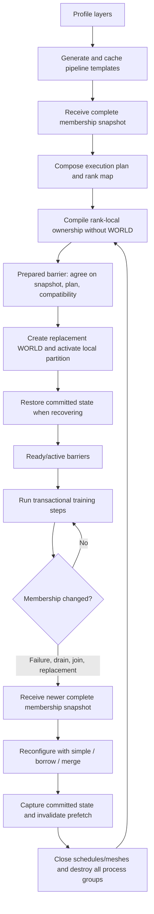
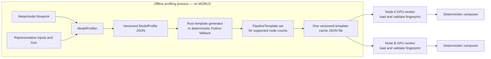
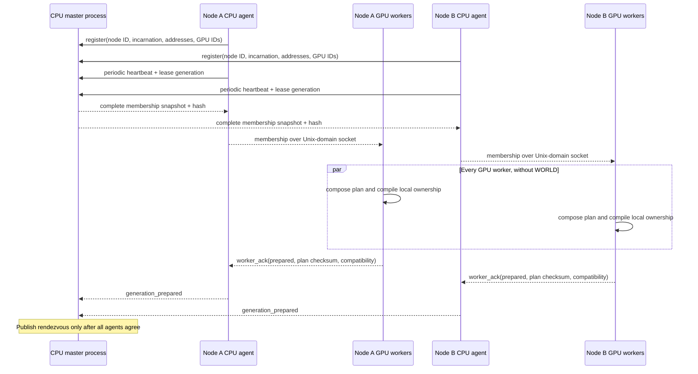
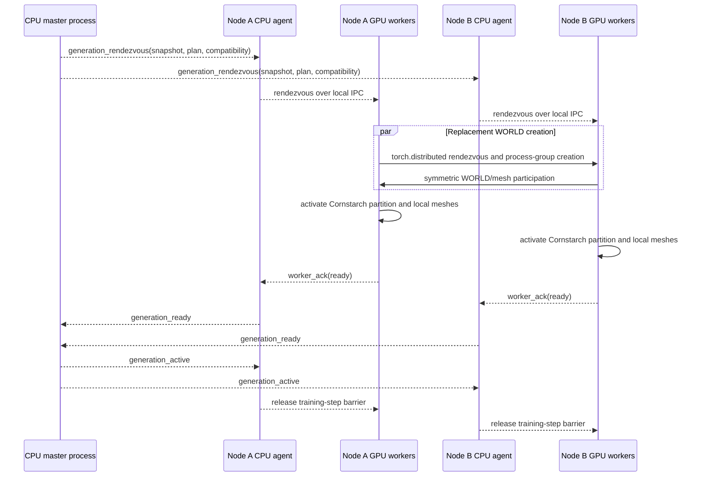
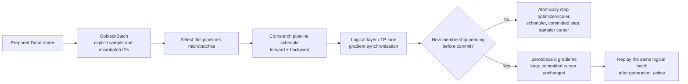
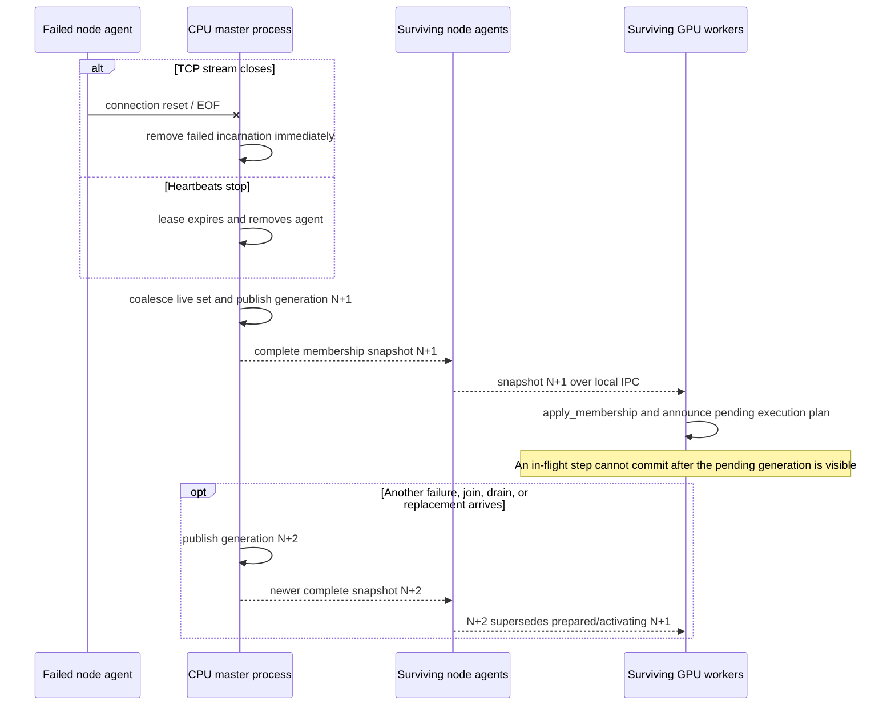
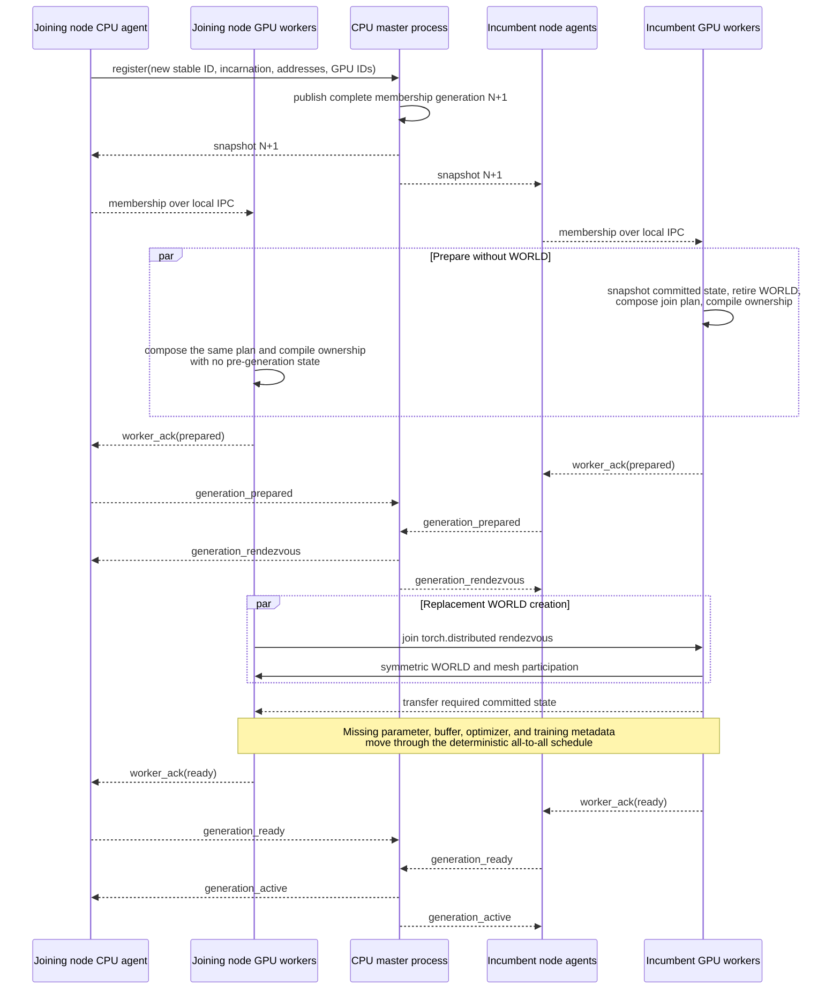
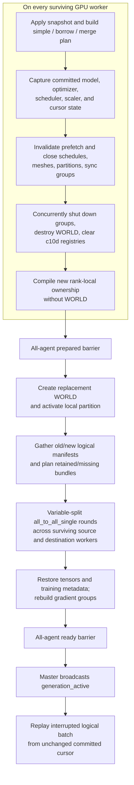

# Oobleck runtime lifecycle

[Back to the main README](README.md).

Oobleck separates the CPU control plane from the distributed training data
plane. The control plane decides which complete membership generation may run;
the data plane compiles ownership, creates that generation's process groups,
executes transactional steps, and moves committed state when membership
changes.



### 1. Profile the model and generate pipeline templates



[`planning/profiler.py`](oobleck/planning/profiler.py) measures each repeated
layer's execution time, activation memory, and persistent state. The resulting
versioned `ModelProfile` can be saved and loaded independently of a running
distributed job. [`planning/generator.py`](oobleck/planning/generator.py) turns
those layer measurements into candidate `PipelineTemplate` objects through the
Rust planner extension, with a deterministic Python fallback.

#### Template cache format

[`planning/cache.py`](oobleck/planning/cache.py) **writes** one pretty-printed,
versioned JSON document to the caller-supplied path. The file contains one
compatibility fingerprint and a `templates` array, so a compatible set of
one-node, two-node, and larger templates normally shares one cache file; it is
not one template per file. `load_templates()` rejects a schema or fingerprint
mismatch before returning any template.

A shortened two-template cache looks like this:

```json
{
  "fingerprint": {
    "cornstarch_version": "71cf4ad681cfefdbf4a5b61d524af9033bebd055",
    "dtype": "bfloat16",
    "hardware": "NVIDIA-H100-80GB",
    "model": "gpt2-xl",
    "schema_version": 1,
    "tensor_parallel_size": 8
  },
  "schema_version": 1,
  "templates": [
    {
      "activation_memory": 2147483648,
      "backward_time": 0.24,
      "communication_time": 0.01,
      "fingerprint": {
        "cornstarch_version": "71cf4ad681cfefdbf4a5b61d524af9033bebd055",
        "dtype": "bfloat16",
        "hardware": "NVIDIA-H100-80GB",
        "model": "gpt2-xl",
        "schema_version": 1,
        "tensor_parallel_size": 8
      },
      "forward_time": 0.12,
      "layer_ranges": [[0, 48]],
      "max_microbatches": 16,
      "persistent_memory": 12884901888,
      "schema_version": 1,
      "template_id": "gpt2-xl-stages-1",
      "tensor_parallel_size": 8
    },
    {
      "activation_memory": 1288490188,
      "backward_time": 0.14,
      "communication_time": 0.02,
      "fingerprint": {
        "cornstarch_version": "71cf4ad681cfefdbf4a5b61d524af9033bebd055",
        "dtype": "bfloat16",
        "hardware": "NVIDIA-H100-80GB",
        "model": "gpt2-xl",
        "schema_version": 1,
        "tensor_parallel_size": 8
      },
      "forward_time": 0.07,
      "layer_ranges": [[0, 24], [24, 48]],
      "max_microbatches": 24,
      "persistent_memory": 7516192768,
      "schema_version": 1,
      "template_id": "gpt2-xl-stages-2",
      "tensor_parallel_size": 8
    }
  ]
}
```

The numeric values above are illustrative; the profiler and generator supply
them for the selected model and hardware.

#### How heterogeneous composition is chosen

[`planning/composer.py`](oobleck/planning/composer.py) does not choose one
single template. Given the current node count, global microbatch count, and
fault-tolerance threshold, it:

1. enumerates every multiset of templates whose `resource_count` exactly covers
   the available nodes and contains at least `fault_tolerance_threshold + 1`
   pipeline replicas;
2. assigns concrete sorted node IDs to each candidate; at a generation boundary
   it first maximizes bytes of state retained in place and then minimizes moved
   surviving nodes;
3. gives every pipeline at least one microbatch, respects each template's
   `max_microbatches`, and finds the smallest predicted makespan that can hold
   the complete global batch;
4. selects the candidate with the lexicographic objective
   `(maximum predicted iteration time, -retained state bytes, moved nodes,
   template IDs, stable pipeline/node IDs)`.

This is based on the [Oobleck paper's Section 4.2 pipeline-instantiation
algorithm](https://insujang.github.io/assets/pdf/sosp23_oobleck.pdf): enumerate
feasible template combinations, distribute the global batch, and select the
fastest plan. It is a deterministic reimplementation rather than a line-for-line
port of the SOSP artifact. The current code minimizes predicted makespan directly
and uses `PipelineTemplate.iteration_time()` (including its serialized
communication time), instead of the artifact's Pyomo variance objective and
separate all-reduce lookup. It also adds memory-capacity checks and the
retained-state/movement/stable-ID tie-breaks needed for elastic generations.
The paper's Section 5.1 simple/borrow/merge failure algorithm is implemented
separately in
[`planning/reconfiguration.py`](oobleck/planning/reconfiguration.py).

### 2. Register nodes and compile ownership before WORLD

The master and node agents communicate only through the CPU control plane in
[`elastic/`](oobleck/elastic/). An agent registers its stable node ID,
incarnation, reachable addresses, and GPU IDs, then maintains a heartbeat lease.
The master publishes every join, replacement, drain, disconnect, or lease
expiry as a complete, monotonically newer `MembershipSnapshot`.



Each GPU worker receives the snapshot from its local agent over the Unix-domain
relay in [`elastic/local_ipc.py`](oobleck/elastic/local_ipc.py). It gives the
membership to `OobleckParallelizationPlan`, which:

1. uses [`planning/composer.py`](oobleck/planning/composer.py) for the initial
   layout or [`planning/reconfiguration.py`](oobleck/planning/reconfiguration.py)
   for a simple, borrow, or merge recovery;
2. creates a stable node/rank map and an immutable, checksummed
   `OobleckExecutionPlan`;
3. calls [`cornstarch.py`](oobleck/cornstarch.py) to compile the rank-local
   stage and logical state manifest without initializing `torch.distributed` or
   allocating real parameter storage.

Workers report the snapshot hash, plan checksum, and runtime compatibility
digest through the **prepared** barrier. The master publishes rendezvous data
only after every agent agrees on all three values.

### 3. Initialize distributed execution

After the prepared barrier,
[`distributed/lifecycle.py`](oobleck/distributed/lifecycle.py) creates exactly
one replacement WORLD from the generation's deterministic rank map and
rendezvous address. [`cornstarch.py`](oobleck/cornstarch.py) then activates the
compiled local partition, materializes local state, and constructs the
per-pipeline meshes from [`meshes.py`](oobleck/meshes.py).



[`topology.py`](oobleck/topology.py) builds additional gradient synchronization
groups by stable logical layer identity and TP lane, allowing parameters shared
across heterogeneous pipeline replicas to receive correctly weighted global
gradients. Each worker reports **ready** only after activation and any recovery
finish. The master sends **generation active** only when every agent is ready;
managed training steps remain blocked until that final barrier.

### 4. Execute a transactional training step

[`data_base.py`](oobleck/data_base.py) assigns explicit sample indices and
global microbatch IDs to every logical batch. DataLoader prefetch may run ahead,
but `OobleckBatchSampler.committed_cursor` advances only when the step commits.
Logical RNG seeds depend on the batch and microbatch identity rather than the
physical rank, so replay uses the same data and randomness after reconfiguration.



`OobleckParallelContext.step()` in
[`runtime_base.py`](oobleck/runtime_base.py) executes only the microbatches
assigned to the local pipeline, synchronizes Cornstarch and heterogeneous
replica gradients, and then atomically advances:

- optimizer and optional gradient scaler;
- scheduler;
- committed training step;
- DataLoader sampler cursor.

If a membership change becomes pending before that atomic commit, Oobleck
discards the attempt's gradients and does not advance any of those objects.

### 5. Detect failures and propagate membership events

[`elastic/service.py`](oobleck/elastic/service.py) and
[`elastic/service_public_base.py`](oobleck/elastic/service_public_base.py) run
the reconnecting agent streams. A TCP close is an immediate failure signal;
otherwise [`elastic/membership.py`](oobleck/elastic/membership.py) expires the
agent's heartbeat lease. The same state machine handles explicit drains, new
nodes, and a new incarnation replacing an old node identity.



The event path is:

```text
master membership state machine
  -> complete membership snapshot over TCP
  -> node agent
  -> local Unix-domain relay
  -> every local GPU worker
  -> OobleckParallelContext.apply_membership()
```

The master coalesces the current live set into a generation rather than sending
rank-local patches. If another event arrives while a generation is preparing or
recovering, the newer complete snapshot supersedes the stale generation; that
generation is torn down and never becomes active.

#### 5-1. Add nodes and scale out

A new node starts one CPU agent and its configured GPU workers. The agent
registers a new stable node ID, incarnation, addresses, and GPU inventory with
the master. Registration proposes a complete membership generation containing
both the incumbent and joining nodes; it does not add ranks to the active WORLD
in place.



When [`planning/reconfiguration.py`](oobleck/planning/reconfiguration.py) sees
a node identity that was not in the previous execution plan, it calls the
heterogeneous composer over the entire expanded membership, up to
`max_nodes`, and records the strategy as `join`. The objective is still
throughput first. If candidates have equal predicted iteration time, it
maximizes retained state bytes, minimizes moved incumbent nodes, and finally
uses stable identities as deterministic tie-breakers. Consequently, a join may
create another pipeline replica, enlarge existing pipelines, or choose a
different heterogeneous combination; it is not necessarily an append-only
layout change.

All workers derive a new stable rank map, so an incumbent numeric global rank
may change when a lexicographically earlier node ID joins even though its stable
node and pipeline identities remain retained. Each worker validates the fixed
per-node TP width, compatibility digest, snapshot hash, and plan checksum before
the master publishes rendezvous data.

Incumbent workers capture the last committed state before destroying the old
WORLD. For this bootstrap, joining workers must prepare with
`recover_from_survivors=True`; after activation, `recover_from_survivors()` enters
recovery without a local snapshot. They receive their assigned parameters,
persistent buffers, optimizer slots, and committed training metadata from
surviving sources in the replacement WORLD. State already owned by an
incumbent may remain local; every missing logical bundle uses the same
deterministic all-to-all transfer described in Section 6.
Training resumes only after all incumbent and joining agents pass the ready
barrier and the master broadcasts `generation_active`.

If the expanded membership cannot form a supported template composition, exceeds
`max_nodes`, has the wrong TP width, or disagrees on compatibility or plan
checksums, the proposed generation cannot become active. A still newer join,
failure, drain, or replacement snapshot supersedes this preparation in the same
way as any other membership event.

### 6. Reconfigure workers and copy committed state

The recovery methods layered onto `OobleckParallelContext` in
[`runtime.py`](oobleck/runtime.py) perform two coordinated phases.

When `apply_membership()` receives the newer snapshot, it first updates the
stable membership/rank map and builds a pending execution plan. For a recovery,
[`planning/reconfiguration.py`](oobleck/planning/reconfiguration.py) chooses
the simple, borrow, or merge layout before the active world is retired.



**Prepare the new generation:**

1. [`recovery_base.py`](oobleck/recovery_base.py) captures the last committed
   parameter, persistent-buffer, optimizer, scheduler, scaler, and step state.
2. Prepared DataLoaders invalidate prefetched but uncommitted batches.
3. The active Cornstarch partition, schedules, meshes, and heterogeneous
   gradient groups close.
4. [`distributed/lifecycle.py`](oobleck/distributed/lifecycle.py) concurrently
   shuts down every known backend, destroys WORLD, clears the audited PyTorch
   c10d registries, and verifies that WORLD is no longer initialized.
5. Cornstarch compiles the pending plan's new local ownership while no
   distributed world exists.

**Activate and recover after rendezvous:**

1. Oobleck creates the replacement WORLD and activates the compiled partition.
2. [`state_base.py`](oobleck/state_base.py) matches old and new state through
   stable logical keys, TP lanes, placements, and committed versions.
3. [`state.py`](oobleck/state.py) plans retained shards and missing state
   transfers. It chunks complete parameter/optimizer bundles and balances source,
   destination, round, and link load across surviving replicas.
4. [`state_transfer.py`](oobleck/state_transfer.py) executes the immutable,
   checksummed schedule with variable-split `all_to_all_single` rounds.
5. [`recovery.py`](oobleck/recovery.py) restores parameters, buffers, optimizer
   slots and groups, scheduler, scaler, and committed-step metadata, then rebuilds
   heterogeneous gradient synchronization.

After every worker reports ready, the master activates the generation. The
interrupted logical batch is fetched again from the unchanged committed cursor
and replayed; it can commit exactly once under the new generation.
